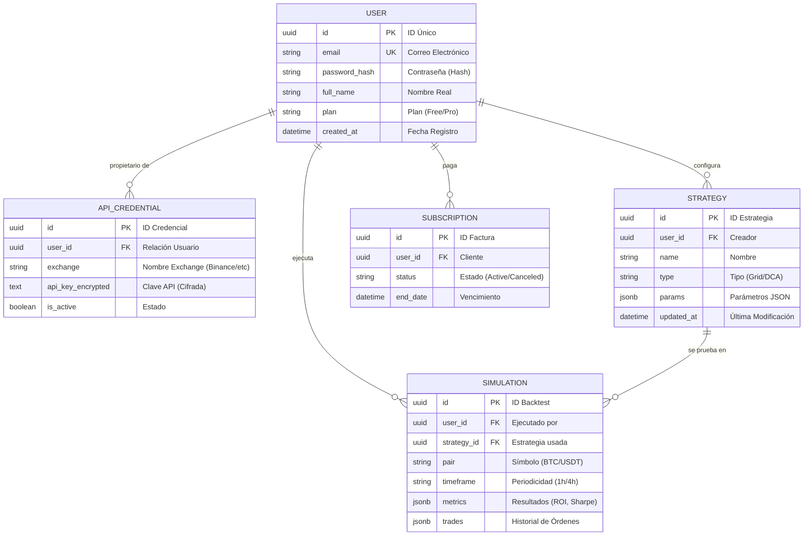

# Diagrama de Entidad Relación (DER) - BotForge

Este archivo está optimizado para ser visualizado con la extensión **Mermaid** de VS Code.

> [!TIP]
> **Para ver el gráfico:** Si tienes la extensión de Mermaid instalada, abre este archivo y presiona `Ctrl + Shift + V` (o haz clic en el icono de "Open Preview" arriba a la derecha) para ver la representación gráfica profesional.
